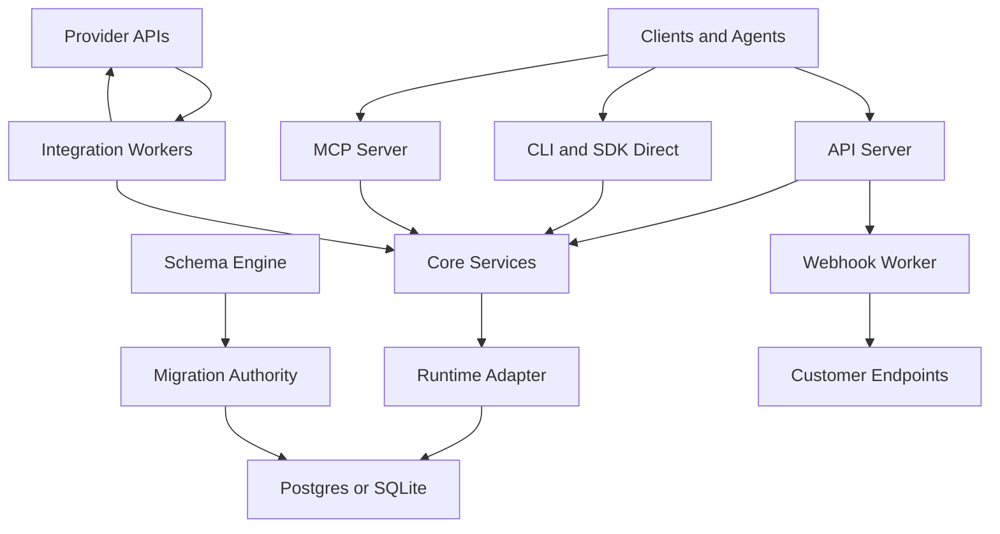

# Orbit AI Threat Model

Date: 2026-03-31
Status: Finalized baseline
Basis: pre-implementation, spec-grounded review

## Decisions And Rationale

Confirmed architecture decisions:

- This repository is still pre-alpha and the threat model is based on the current docs/spec baseline, not running package code.
- One Orbit project maps to one database.
- Developers choose the project database and initial adapter, with Supabase and Neon first and SQLite for local/dev.
- A project may operate in single-organization mode or multi-organization mode.
- Hosted Orbit should provision one database per project rather than placing many customer projects inside one shared application database.
- SQLite is local/dev only and is not treated as a production isolation boundary.
- v1 authentication is API-key based, with end-user identity supplied by the embedding app or auth provider.
- Hosted v1 restricts live schema apply/rollback and treats preview as customer-facing but live apply/rollback as controlled admin/operator functionality.
- Hosted Orbit blocks private/internal webhook destinations by default and allows only public HTTPS webhook targets.

Why these decisions were chosen:

- One database per project keeps the product model easy to explain to developers and avoids mixing Orbit’s platform architecture with the customer’s own CRM tenancy model.
- Single-org and multi-org both remain valid inside the same product model, which keeps Orbit useful for internal CRM use cases and SaaS-builder use cases.
- Restricting hosted schema apply/rollback reduces the chance of customer-triggered destructive migrations, support-heavy incidents, and security drift while preserving schema preview as a product capability.
- Blocking private/internal webhook destinations removes a common hosted SSRF class without limiting self-hosted or local developer flexibility.

What these decisions enable:

- Cleaner product positioning: Orbit is infrastructure installed per project, not a giant shared CRM cloud by default.
- Better isolation story for hosted customers because each hosted project gets its own database boundary.
- Safer hosted launch because the riskiest schema and outbound-network behaviors are constrained.

What these decisions disable or defer:

- No “many customer projects in one giant hosted application database” operating model for v1.
- No unrestricted customer-run schema apply/rollback in hosted v1.
- No hosted delivery to private/internal webhook destinations unless a future explicit exception model is designed.

## Executive Summary

Orbit AI’s highest-risk themes are cross-tenant data exposure, misuse of privileged database authority, and secret leakage through multi-surface interfaces such as API, CLI, MCP, webhooks, and connectors. The most security-critical areas are the tenant context boundary in [docs/specs/01-core.md](/Users/sharonsciammas/orbit-ai/docs/specs/01-core.md), API auth and route model in [docs/specs/02-api.md](/Users/sharonsciammas/orbit-ai/docs/specs/02-api.md), and connector credential/storage behavior in [docs/specs/06-integrations.md](/Users/sharonsciammas/orbit-ai/docs/specs/06-integrations.md).

## Scope And Assumptions

In scope:

- [docs/specs/01-core.md](/Users/sharonsciammas/orbit-ai/docs/specs/01-core.md)
- [docs/specs/02-api.md](/Users/sharonsciammas/orbit-ai/docs/specs/02-api.md)
- [docs/specs/03-sdk.md](/Users/sharonsciammas/orbit-ai/docs/specs/03-sdk.md)
- [docs/specs/04-cli.md](/Users/sharonsciammas/orbit-ai/docs/specs/04-cli.md)
- [docs/specs/05-mcp.md](/Users/sharonsciammas/orbit-ai/docs/specs/05-mcp.md)
- [docs/specs/06-integrations.md](/Users/sharonsciammas/orbit-ai/docs/specs/06-integrations.md)
- [docs/security/security-architecture.md](/Users/sharonsciammas/orbit-ai/docs/security/security-architecture.md)
- [docs/security/database-hardening-checklist.md](/Users/sharonsciammas/orbit-ai/docs/security/database-hardening-checklist.md)
- [docs/META-PLAN.md](/Users/sharonsciammas/orbit-ai/docs/META-PLAN.md)

Out of scope:

- CI/CD and release pipeline threats
- npm supply-chain threats
- frontend example apps and docs-site risks
- implementation-specific bugs in code that does not yet exist

Assumptions:

- Hosted API, hosted MCP HTTP transport, webhook delivery workers, and integration sync workers are internet-exposed services.
- Hosted deployments provision one database per Orbit project.
- Multi-tenancy risk is primarily organization-level isolation inside a project, not cross-project isolation inside one shared app database.
- CLI direct mode runs with operator-controlled local credentials.
- Provider credentials are stored server-side and never returned after creation, per [docs/specs/06-integrations.md](/Users/sharonsciammas/orbit-ai/docs/specs/06-integrations.md).
- The database role split described in [docs/security/security-architecture.md](/Users/sharonsciammas/orbit-ai/docs/security/security-architecture.md) is implemented as specified.
- Hosted schema preview may be customer-visible, but hosted apply/rollback is controlled.
- Hosted outbound webhooks are limited to public HTTPS destinations.

## System Model

### Primary Components

- `@orbit-ai/core`: schema engine, entity services, tenant context, RLS generation, adapter interface. Evidence: [docs/specs/01-core.md](/Users/sharonsciammas/orbit-ai/docs/specs/01-core.md).
- `@orbit-ai/api`: Hono API, auth middleware, tenant context middleware, idempotency, rate limiting, webhook delivery endpoints. Evidence: [docs/specs/02-api.md](/Users/sharonsciammas/orbit-ai/docs/specs/02-api.md).
- `@orbit-ai/sdk`: HTTP mode and direct-adapter mode with parity across both. Evidence: [docs/specs/03-sdk.md](/Users/sharonsciammas/orbit-ai/docs/specs/03-sdk.md).
- `@orbit-ai/cli`: human/agent terminal entrypoint with hosted and direct modes. Evidence: [docs/specs/04-cli.md](/Users/sharonsciammas/orbit-ai/docs/specs/04-cli.md).
- `@orbit-ai/mcp`: 23-core-tool agent interface over stdio or HTTP. Evidence: [docs/specs/05-mcp.md](/Users/sharonsciammas/orbit-ai/docs/specs/05-mcp.md).
- `@orbit-ai/integrations`: Gmail, Google Calendar, Stripe connectors plus extension CLI/MCP surfaces and sync state. Evidence: [docs/specs/06-integrations.md](/Users/sharonsciammas/orbit-ai/docs/specs/06-integrations.md).
- Postgres-family adapters: active security boundary via roles, RLS, transaction-local tenant context, and scoped auth lookup. Evidence: [docs/specs/01-core.md](/Users/sharonsciammas/orbit-ai/docs/specs/01-core.md), [docs/security/security-architecture.md](/Users/sharonsciammas/orbit-ai/docs/security/security-architecture.md).

### Data Flows And Trust Boundaries

- Internet or operator client -> API server
  Data: API keys, CRUD payloads, search filters, schema ops, webhook registration, import payloads.
  Channel: HTTPS.
  Security guarantees: API-key auth, scope checks, request IDs, rate limiting, idempotency, schema validation.
  Evidence: [docs/specs/02-api.md](/Users/sharonsciammas/orbit-ai/docs/specs/02-api.md).

- API server -> core services -> storage adapter
  Data: tenant-scoped records, audit entries, idempotency rows, schema operations.
  Channel: in-process calls.
  Security guarantees: service-layer `organization_id` injection, `withTenantContext(...)`, runtime vs migration authority split.
  Evidence: [docs/specs/01-core.md](/Users/sharonsciammas/orbit-ai/docs/specs/01-core.md).

- Runtime app role -> Postgres-family database
  Data: tenant data, auth lookup results, webhook rows, integration state.
  Channel: SQL.
  Security guarantees: explicit tenant filters, RLS, transaction-local org context, narrow `lookup_api_key_for_auth`.
  Evidence: [docs/specs/01-core.md](/Users/sharonsciammas/orbit-ai/docs/specs/01-core.md), [docs/security/security-architecture.md](/Users/sharonsciammas/orbit-ai/docs/security/security-architecture.md).

- Schema engine or operator flow -> migration authority -> database DDL
  Data: migration SQL, rollback SQL, schema metadata.
  Channel: SQL with elevated role.
  Security guarantees: explicit `runWithMigrationAuthority(...)`, non-destructive-by-default rules, branch-before-migrate on Neon.
  Evidence: [docs/specs/01-core.md](/Users/sharonsciammas/orbit-ai/docs/specs/01-core.md).

- CLI or SDK direct mode -> core services
  Data: local operator input, trusted `orgId`/`userId`, mutation commands.
  Channel: in-process.
  Security guarantees: same service layer, same envelope semantics, direct mode requires trusted context.
  Evidence: [docs/specs/03-sdk.md](/Users/sharonsciammas/orbit-ai/docs/specs/03-sdk.md), [docs/specs/04-cli.md](/Users/sharonsciammas/orbit-ai/docs/specs/04-cli.md).

- Agent runtime -> MCP server
  Data: tool arguments, record IDs, search filters, connector actions.
  Channel: stdio or HTTP.
  Security guarantees: safety hints, sanitized DTOs for secret-bearing objects, shared core tool registry.
  Evidence: [docs/specs/05-mcp.md](/Users/sharonsciammas/orbit-ai/docs/specs/05-mcp.md).

- API webhook delivery worker -> customer endpoints
  Data: signed event payloads, webhook metadata.
  Channel: outbound HTTPS.
  Security guarantees: Standard Webhooks contract, signatures, retries, idempotency keys, sanitized admin reads.
  Evidence: [docs/specs/02-api.md](/Users/sharonsciammas/orbit-ai/docs/specs/02-api.md).

- Provider APIs/webhooks -> integration handlers
  Data: OAuth tokens, provider events, sync cursors, payment status, email/calendar metadata.
  Channel: HTTPS, provider webhook callbacks, polling.
  Security guarantees: provider-specific verification, sanitized read DTOs, server-owned credential storage.
  Evidence: [docs/specs/06-integrations.md](/Users/sharonsciammas/orbit-ai/docs/specs/06-integrations.md).

#### Diagram

## Assets And Security Objectives

- Tenant CRM records
  Objective: confidentiality and integrity.
  Why it matters: cross-tenant exposure is the primary product failure mode. Evidence: [docs/security/security-architecture.md](/Users/sharonsciammas/orbit-ai/docs/security/security-architecture.md).

- API keys and scope assignments
  Objective: confidentiality and authorization integrity.
  Why it matters: stolen or over-scoped keys provide broad tenant or platform access. Evidence: [docs/specs/02-api.md](/Users/sharonsciammas/orbit-ai/docs/specs/02-api.md).

- Connector credentials and refresh tokens
  Objective: confidentiality and integrity.
  Why it matters: compromise extends impact into Gmail, Google Calendar, or Stripe. Evidence: [docs/specs/06-integrations.md](/Users/sharonsciammas/orbit-ai/docs/specs/06-integrations.md).

- Webhook secrets and event authenticity
  Objective: integrity and replay resistance.
  Why it matters: forged or replayed events can trigger external side effects or poison sync state. Evidence: [docs/specs/02-api.md](/Users/sharonsciammas/orbit-ai/docs/specs/02-api.md).

- Schema definitions and migration authority
  Objective: integrity and availability.
  Why it matters: malicious or accidental schema changes can destroy tenant isolation or availability. Evidence: [docs/specs/01-core.md](/Users/sharonsciammas/orbit-ai/docs/specs/01-core.md).

- Audit, idempotency, and webhook delivery records
  Objective: integrity and forensic usefulness.
  Why it matters: these records are required for attribution, replay handling, and incident response. Evidence: [docs/specs/01-core.md](/Users/sharonsciammas/orbit-ai/docs/specs/01-core.md), [docs/specs/02-api.md](/Users/sharonsciammas/orbit-ai/docs/specs/02-api.md).

## Attacker Model

Capabilities:

- Remote internet attacker with no credentials can hit hosted API, hosted MCP HTTP endpoints, provider webhook endpoints, and customer webhook endpoints indirectly.
- Tenant attacker with a valid API key can send high-volume CRUD, search, schema-preview, import, and webhook-management requests within assigned scopes.
- Malicious or compromised connector/provider can send malformed callback payloads or abuse token refresh/error paths.
- Prompt-driven agent misuse is realistic for CLI/MCP surfaces because Orbit is explicitly built for agent execution. Evidence: [docs/META-PLAN.md](/Users/sharonsciammas/orbit-ai/docs/META-PLAN.md), [docs/specs/05-mcp.md](/Users/sharonsciammas/orbit-ai/docs/specs/05-mcp.md).

Non-capabilities assumed for this draft:

- No assumption of local shell access on the host.
- No assumption of direct database superuser access.
- No assumption of compromise of the customer’s own provider account before attacking Orbit.

## Threat Enumeration

### T1. Cross-Tenant Read Or Write Through Tenant-Context Failure

Attacker story:

- A tenant attacker or malformed internal flow hits an API, SDK direct, or MCP path that misses `withTenantContext(...)`, misses explicit `organization_id` filtering, or leaks connection-local state across pooled Postgres usage.
- The attacker reads or mutates another organization’s records, webhook configs, or integration state.

Impacted assets:

- Tenant CRM records
- Connector state
- Audit integrity

Evidence anchors:

- Transaction-bound tenant context and pooled-connection warning in [docs/specs/01-core.md](/Users/sharonsciammas/orbit-ai/docs/specs/01-core.md)
- Defense-in-depth tenant filtering in [docs/security/security-architecture.md](/Users/sharonsciammas/orbit-ai/docs/security/security-architecture.md)
- Tenant middleware in [docs/specs/02-api.md](/Users/sharonsciammas/orbit-ai/docs/specs/02-api.md)

Likelihood: Medium

The spec is unusually explicit here, which lowers risk, but this is still the core invariant and the system has multiple access modes: API, direct SDK, CLI, MCP, plugins, and workers.

Impact: High

This is a direct cross-tenant breach and would be existential for a CRM infrastructure product.

Overall priority: Critical

Existing mitigations:

- Tenant-scoped tables and RLS generation
- `withTenantContext(...)` with transaction-local semantics
- Service-layer `organization_id` injection rules

Gaps:

- Direct mode and plugin extension paths increase the number of places where tenant scoping can be implemented incorrectly.
- SQLite cannot provide DB-enforced isolation.

Recommended mitigations:

- Add mandatory tenant-safety tests for every service and adapter.
- Require a `tenant-scoped` review gate for any new repository/service/plugin table.
- Make SQLite explicitly unsupported for tenant-sensitive hosted use.

Detection:

- Alert on impossible cross-org access patterns.
- Audit-log anomaly detection for mismatched actor org vs entity org.

### T2. Privileged Credential Or Migration Authority Misuse

Attacker story:

- A bug, misconfiguration, or convenience path routes generic request handling through migration/elevated authority, `service_role`, or a too-broad auth lookup surface.
- An attacker with ordinary API access escalates into schema mutation, unrestricted tenant reads, or policy bypass.

Impacted assets:

- All tenant data
- Schema integrity
- Availability

Evidence anchors:

- Runtime vs migration authority split in [docs/specs/01-core.md](/Users/sharonsciammas/orbit-ai/docs/specs/01-core.md)
- Required role model in [docs/security/security-architecture.md](/Users/sharonsciammas/orbit-ai/docs/security/security-architecture.md)
- Runtime-boundary rules in [docs/specs/02-api.md](/Users/sharonsciammas/orbit-ai/docs/specs/02-api.md)

Likelihood: Medium

The spec now draws the boundary well, but the combination of admin routes, bootstrap routes, schema routes, and provider workers creates pressure to weaken it during implementation.

Impact: High

Any escape from the runtime role model collapses RLS and tenant isolation and can enable destructive schema changes.

Overall priority: High

Existing mitigations:

- Explicit `runWithMigrationAuthority(...)`
- Narrow `lookupApiKeyForAuth(...)`
- Ban on service-role usage for request paths

Gaps:

- Hosted operational tooling and future background jobs may be tempted to share elevated credentials.
- The threat is highly sensitive to deployment shortcuts.

Recommended mitigations:

- Enforce separate DSNs/credentials for runtime and migration roles.
- Add startup assertions that refuse to boot API/MCP runtimes with migration-role credentials.
- Review all schema routes as privileged code paths.

Detection:

- Alert when runtime services execute DDL.
- Log role/authority class per request and per job.

### T3. Secret Leakage Through API, CLI, MCP, Logs, Or Error Paths

Attacker story:

- A tenant, operator, or agent requests webhook, connector, or delivery objects and receives plaintext secrets, tokens, signed payloads, or raw provider error strings.
- Alternatively, the same secrets leak through error messages, MCP tool output, CLI JSON, or audit snapshots.

Impacted assets:

- API keys
- Webhook secrets
- Connector tokens
- Provider credentials

Evidence anchors:

- Sanitized webhook DTOs in [docs/specs/02-api.md](/Users/sharonsciammas/orbit-ai/docs/specs/02-api.md)
- Secret-output restrictions in [docs/security/security-architecture.md](/Users/sharonsciammas/orbit-ai/docs/security/security-architecture.md)
- MCP sanitized DTO rules in [docs/specs/05-mcp.md](/Users/sharonsciammas/orbit-ai/docs/specs/05-mcp.md)
- Connector serializer rules in [docs/specs/06-integrations.md](/Users/sharonsciammas/orbit-ai/docs/specs/06-integrations.md)

Likelihood: Medium

Orbit intentionally exposes the same data across several interfaces, and agent-facing surfaces increase the chance of accidental oversharing.

Impact: High

Token or secret leakage expands impact beyond Orbit into external customer systems.

Overall priority: High

Existing mitigations:

- Sanitized read DTOs for webhook and integration objects
- Redaction markers such as `credentials_redacted`, `cursor_redacted`, and `error_redacted`
- One-time-only webhook secret return on create

Gaps:

- Manual serializer discipline is still required.
- Audit logging of before/after snapshots remains sensitive.

Recommended mitigations:

- Centralize all secret-bearing serializers in shared packages with no ad hoc bypasses.
- Add snapshot redaction middleware before audit persistence.
- Add snapshot tests asserting no secret fields appear in API, CLI, or MCP outputs.

Detection:

- Redaction lint/tests on DTO serializers.
- Alert on logs containing token-like strings.

### T4. SSRF Or Internal Network Reachability Through Outbound Webhooks And Connectors

Attacker story:

- A tenant registers a webhook URL or configures a connector endpoint that targets internal infrastructure, metadata services, or operator-only endpoints.
- Orbit’s outbound workers connect to internal targets and leak data or become a pivot point.

Impacted assets:

- Internal network resources
- Operator credentials
- Availability of webhook workers

Evidence anchors:

- Webhook registration and delivery in [docs/specs/02-api.md](/Users/sharonsciammas/orbit-ai/docs/specs/02-api.md)
- Connector/provider trust boundary in [docs/security/security-architecture.md](/Users/sharonsciammas/orbit-ai/docs/security/security-architecture.md)

Likelihood: Medium

The product explicitly supports arbitrary outbound webhooks and third-party integrations, which makes this class realistic unless outbound destinations are constrained.

Impact: High

Successful SSRF could expose control-plane services or cloud metadata, depending on hosting architecture.

Overall priority: High

Existing mitigations:

- Hosted policy decision to block private/internal webhook destinations and require public HTTPS targets.
- Signed delivery semantics.

Gaps:

- The hosted policy decision still needs to be encoded concretely in destination validation, DNS resolution rules, and worker egress controls.

Recommended mitigations:

- For hosted Orbit, block RFC1918, link-local, loopback, and metadata-service destinations by default.
- Resolve DNS twice and re-check IP class before connect.
- Enforce HTTPS for hosted outbound webhooks except explicitly approved local dev modes.

Detection:

- Log and alert on blocked internal destination attempts.
- Monitor webhook worker destination classes and failure patterns.

### T5. Forged Or Replayed Provider And Customer Webhooks

Attacker story:

- An attacker replays previously valid webhook traffic or forges Stripe/customer webhook events without valid signature/timestamp verification.
- Orbit triggers duplicate side effects, corrupts sync state, or causes external actions.

Impacted assets:

- Record integrity
- Payment and contract workflows
- Sync correctness

Evidence anchors:

- Standard Webhooks model and replay-sensitive headers in [docs/specs/02-api.md](/Users/sharonsciammas/orbit-ai/docs/specs/02-api.md)
- Connector/provider boundary in [docs/specs/06-integrations.md](/Users/sharonsciammas/orbit-ai/docs/specs/06-integrations.md)

Likelihood: Medium

Webhook security is a known sharp edge, especially when multiple inbound and outbound webhook systems coexist.

Impact: Medium

The likely result is duplicate or poisoned business events rather than total compromise, but financial and workflow side effects can still be significant.

Overall priority: Medium

Existing mitigations:

- Standard Webhooks delivery contract
- Idempotency keys
- Explicit separation of outbound customer webhooks vs inbound provider webhooks

Gaps:

- Provider-specific signature verification and replay-window enforcement are not yet fully frozen in one baseline doc.

Recommended mitigations:

- Define provider-specific replay windows and canonical verification helpers.
- Persist webhook receipt IDs and signature timestamps for replay detection.
- Add negative tests for stale timestamp and signature-mismatch cases.

Detection:

- Alert on replay-window rejects and repeated event IDs.

### T6. Malicious Or Unsafe Schema Evolution Through Agent-Driven Flows

Attacker story:

- A compromised admin key, over-permissive agent workflow, or implementation bug uses schema routes or CLI migration flows to add abusive fields, degrade indexes, or execute unsafe migration SQL.
- Even without full destructive operations, the attacker can degrade availability or bypass intended review controls.

Impacted assets:

- Database availability
- Schema integrity
- Tenant isolation if policy generation is bypassed

Evidence anchors:

- Schema engine and non-destructive defaults in [docs/specs/01-core.md](/Users/sharonsciammas/orbit-ai/docs/specs/01-core.md)
- Product positioning around agent-safe migrations in [docs/META-PLAN.md](/Users/sharonsciammas/orbit-ai/docs/META-PLAN.md)

Likelihood: Medium

This is not a generic SaaS problem; Orbit intentionally exposes schema evolution as a feature, and agents are first-class actors.

Impact: High

Bad migrations can break availability or weaken the security model across all tenants of a deployment.

Overall priority: High

Existing mitigations:

- Non-destructive-by-default rules
- Explicit migration authority separation
- Branch-before-migrate on Neon

Gaps:

- The hosted restriction now exists as a policy decision, but it still must be encoded concretely in route exposure, approval flow, and operational tooling.

Recommended mitigations:

- Require human approval or dual control for destructive and high-impact schema changes in hosted mode.
- Run static migration-policy checks before apply.
- Add rollback rehearsal requirements for hosted operations.

Detection:

- Alert on repeated failed migrations and policy-generation diffs.

## Mitigations And Recommendations

Highest-priority implementation gates before general package coding:

- Encode the one-project-one-database hosted model explicitly in provisioning, operations, and customer-facing docs.
- Enforce startup/runtime credential assertions so request-serving packages cannot boot with migration-capable credentials.
- Build shared serializer/redaction libraries before exposing webhook or connector records through API, CLI, or MCP.
- Write outbound network egress rules for hosted webhook delivery and integration workers.
- Define provider webhook verification helpers and replay-window rules as shared integration utilities.
- Make tenant-safety and authority-boundary review mandatory for every new adapter, service, route, and plugin table.

## Focus Paths For Manual Security Review

- [docs/specs/01-core.md](/Users/sharonsciammas/orbit-ai/docs/specs/01-core.md)
  Reason: tenant context, RLS, adapter authority, and migration boundaries are the core security model.
- [docs/specs/02-api.md](/Users/sharonsciammas/orbit-ai/docs/specs/02-api.md)
  Reason: auth, scope enforcement, route exposure, webhook handling, and sanitized output rules all converge here.
- [docs/specs/05-mcp.md](/Users/sharonsciammas/orbit-ai/docs/specs/05-mcp.md)
  Reason: agent-facing tool exposure and sanitized output behavior create a unique leakage and misuse surface.
- [docs/specs/06-integrations.md](/Users/sharonsciammas/orbit-ai/docs/specs/06-integrations.md)
  Reason: connector credentials, sync state, inbound provider events, and extension tools are the main external trust boundary.
- [docs/security/security-architecture.md](/Users/sharonsciammas/orbit-ai/docs/security/security-architecture.md)
  Reason: this is the normative security baseline and role model.
- [docs/security/database-hardening-checklist.md](/Users/sharonsciammas/orbit-ai/docs/security/database-hardening-checklist.md)
  Reason: deployment hardening and operational controls can negate or preserve the design.
- [docs/META-PLAN.md](/Users/sharonsciammas/orbit-ai/docs/META-PLAN.md)
  Reason: product scope and architecture intent affect what is actually internet-exposed and customer-facing.
- [docs/product/release-definition-v1.md](/Users/sharonsciammas/orbit-ai/docs/product/release-definition-v1.md)
  Reason: release bars should include the highest-priority mitigations from this threat model.

## Quality Check

- All current runtime entrypoints discovered in the docs are covered: API, SDK direct mode, CLI, MCP, webhook workers, integration workers.
- Each primary trust boundary is represented in at least one threat.
- Runtime behavior is separated from out-of-scope CI/build concerns.
- Assumptions and finalized product/security decisions are explicit.
- Rankings should be revisited only if hosted product boundaries or customer-facing schema authority change.
